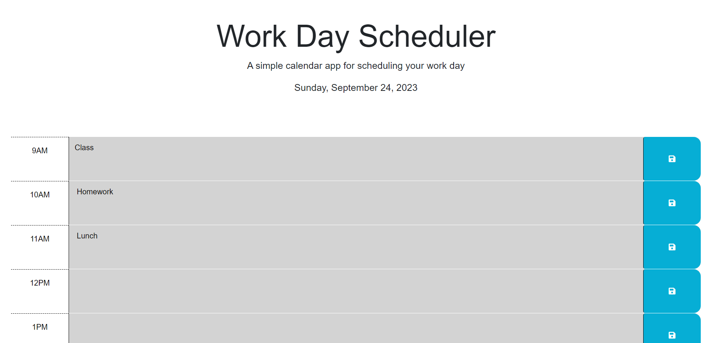

## Work Day Scheduler
The Work Day Scheduler is a simple calendar application designed to help you schedule your workday. It provides a clean and intuitive interface to manage your daily tasks and appointments. The scheduler is divided into hourly time blocks, allowing you to plan your day effectively.

This project utilizes HTML, CSS, JavaScript, and external libraries like Bootstrap and Font Awesome to create a responsive and visually appealing scheduling tool.

## Features
Hourly time blocks for scheduling from 9 AM to 6 PM.
Each time block includes:
Hour indicator.
Text input area for task descriptions.
Save button to store your tasks.
Automatic styling of time blocks based on past, present, and future times.
Use of popular libraries like Bootstrap and Font Awesome for enhanced design.
Responsive layout for both desktop and mobile devices.

## Usage
Open the Work Day Scheduler in your web browser.
You will see time blocks from 9 AM to 6 PM.
Each time block has an hour indicator, a text input area for task descriptions, and a save button.
Type your task or appointment for each hour in the text input area.
Click the "Save" button to store your task.
The time blocks will automatically change color based on whether they are in the past, present, or future.
Your tasks will be saved locally, so you can revisit the scheduler and see your scheduled tasks even after refreshing the page.

## Screenshot
